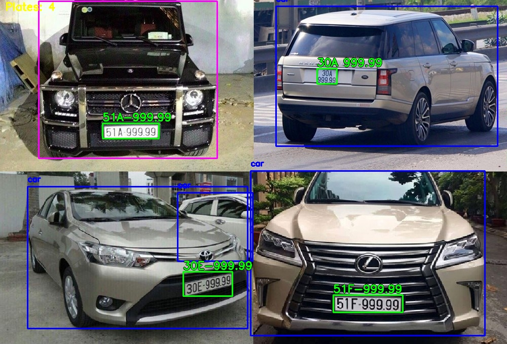
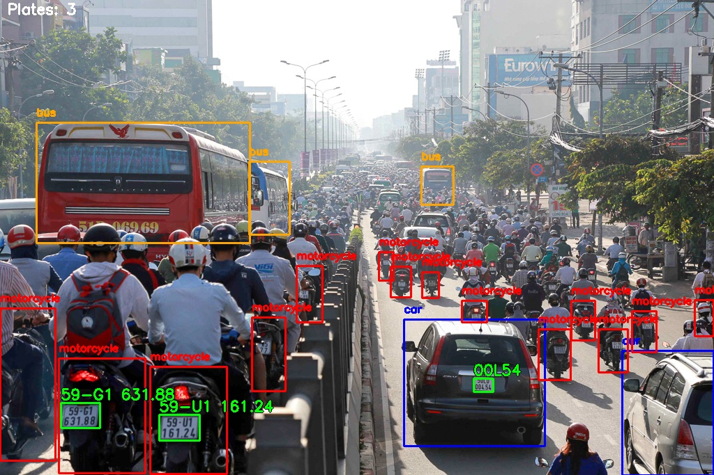

<p align="center">
  <h1 align="center">🚗 Vietnamese License Plate Recognition System</h1>
  <p align="center">
    <em>Real-time vehicle detection and license plate recognition using YOLOv8 & PaddleOCR</em>
  </p>
  <p align="center">
    <a href="#features">Features</a> •
    <a href="#architecture">Architecture</a> •
    <a href="#installation">Installation</a> •
    <a href="#usage">Usage</a> •
    <a href="#model-training">Training</a> •
    <a href="#results">Results</a>
  </p>
</p>

---

## 📋 Overview

<p align="center">
  
  
</p>

An end-to-end real-time Vietnamese license plate recognition system capable of **detecting vehicles**, **localizing license plates**, and **extracting plate text** from both static images and live video feeds. The system leverages a two-stage YOLOv8 detection pipeline combined with PaddleOCR v4 for high-accuracy text recognition.

## ✨ Features

- **Multi-class Vehicle Detection** — Detects cars, trucks, motorcycles, and buses with color-coded bounding boxes
- **License Plate Localization** — Custom-trained YOLOv8 model distinguishing single-line (BSD) and double-line (BSV) Vietnamese plates
- **OCR Text Extraction** — PaddleOCR v4 ONNX pipeline for fast, accurate plate number recognition
- **Real-time Video Processing** — GPU-accelerated inference with live FPS monitoring
- **Image & Video Support** — Process individual images or video files with interactive playback controls
- **Plate Validation** — Regex-based post-processing to validate Vietnamese plate number formats
- **Skew Correction** — Automatic deskewing of rotated plate images for improved OCR accuracy

## 🏗️ Architecture

```
Input (Image/Video)
        │
        ▼
┌───────────────────┐
│  Vehicle Detection │ ◄── YOLOv8s (640px, multi-class)
│  (car/truck/moto)  │
└────────┬──────────┘
         │
         ▼
┌───────────────────┐
│  Plate Detection   │ ◄── YOLOv8n (retrained, BSD/BSV)
│  (localization)    │
└────────┬──────────┘
         │
         ▼
┌───────────────────┐
│  Preprocessing     │ ◄── Deskew, contrast enhancement
│  (skew correction) │
└────────┬──────────┘
         │
         ▼
┌───────────────────┐
│  OCR Recognition   │ ◄── PaddleOCR v4 (ONNX)
│  (text extraction) │
└────────┬──────────┘
         │
         ▼
┌───────────────────┐
│  Post-processing   │ ◄── Regex validation, line merging
│  (plate validation)│
└───────────────────┘
```

## 📁 Project Structure

```
├── camera.py                # Real-time video processing pipeline
├── image.py                 # Static image processing pipeline
├── retrain_model.py         # YOLOv8 model retraining script
├── dataset.yaml             # YOLO training dataset configuration
├── checkGPU.py              # CUDA/GPU availability checker
│
├── function/
│   ├── helper.py            # License plate type classification & reading
│   └── utils_rotate.py      # Image deskew & rotation utilities
│
├── utils/
│   ├── utils.py             # Drawing, preprocessing & detection utilities
│   ├── ocr.py               # PaddleOCR wrapper & text recognition
│   ├── dataset.py           # Dataset handling utilities
│   ├── brand_classifier.py  # Vehicle brand classification
│   ├── color_classifier.py  # Vehicle color classification
│   ├── traffic_configs.py   # Traffic detection configurations
│   └── ppocr_configs.yaml   # PaddleOCR configuration file
│
├── ppocr_onnx/              # PaddleOCR ONNX inference pipeline
│   ├── pipeline.py          # Main detection + recognition pipeline
│   ├── det/                 # Text detection module
│   │   ├── predict_det.py
│   │   ├── preprocess.py
│   │   └── postprocess.py
│   └── rec/                 # Text recognition module
│       ├── predict_rec.py
│       └── rec_decoder.py
│
├── model/                   # Model weights (download separately)
│   ├── LP_detector_retrained.pt
│   ├── vehicle_yolov8s_640.pt
│   └── ppocrv4/
│       ├── ch_PP-OCRv4_det_infer.onnx
│       └── ch_PP-OCRv4_rec_infer.onnx
│
├── test_image/              # Sample test images
├── test_video/              # Sample test videos
└── result/                  # Output results
```

## 🛠️ Installation

### Prerequisites

- Python 3.8+
- NVIDIA GPU with CUDA support (recommended)

### 1. Clone the repository

```bash
git clone https://github.com/minhthang2405/DoAn_Artificial-Intelligence_LicensePlateRegconization.git
cd DoAn_Artificial-Intelligence_LicensePlateRegconization
```

### 2. Install dependencies

```bash
pip install torch torchvision --index-url https://download.pytorch.org/whl/cu118
pip install ultralytics opencv-python numpy onnxruntime-gpu pyyaml pillow
```

### 3. Download model weights

Download the pretrained models and place them in the `model/` directory:

| Model | Description | Size |
|-------|-------------|------|
| `LP_detector_retrained.pt` | License plate detector (YOLOv8n, retrained) | ~6 MB |
| `vehicle_yolov8s_640.pt` | Vehicle detector (YOLOv8s, 640px) | ~90 MB |
| `ch_PP-OCRv4_det_infer.onnx` | PaddleOCR v4 text detection | ~5 MB |
| `ch_PP-OCRv4_rec_infer.onnx` | PaddleOCR v4 text recognition | ~11 MB |

> **Note:** Model weights are not included in the repository due to file size. Contact the repository owner or download from the relevant sources.

### 4. Verify GPU

```bash
python checkGPU.py
```

## 🚀 Usage

### Process a single image

```bash
python image.py
```

- Select an image from the `test_image/` directory
- The system will detect vehicles, locate plates, and extract text
- Results are saved to the `result/` directory

### Process video (real-time)

```bash
python camera.py
```

- Select a video from the `test_video/` directory
- Press **Space** to pause/resume playback
- Press **Q** to quit
- Processed video is automatically saved to `result/video_saved/`

## 🎯 Model Training

### Retrain the license plate detector

1. Prepare your dataset following the YOLO format in `YOLODataset/`:
   ```
   YOLODataset/
   ├── images/
   │   ├── train/
   │   └── val/
   └── labels/
       ├── train/
       └── val/
   ```

2. Update `dataset.yaml` with your dataset paths:
   ```yaml
   train: YOLODataset/images/train/
   val: YOLODataset/images/val/
   nc: 2
   names: ['BSD', 'BSV']   # BSD = single-line, BSV = double-line
   ```

3. Run training:
   ```bash
   python retrain_model.py
   ```

## 📊 Results

| Detection Type | Model | Input Size | Classes |
|---------------|-------|------------|---------|
| Vehicle | YOLOv8s | 640×640 | car, truck, motorcycle, bus |
| License Plate | YOLOv8n (retrained) | 640×640 | BSD (single-line), BSV (double-line) |
| OCR | PaddleOCR v4 (ONNX) | Dynamic | Vietnamese characters + digits |

### Visualization

- **Blue** bounding box → Car
- **Purple** bounding box → Truck
- **Red** bounding box → Motorcycle
- **Orange** bounding box → Bus
- **Green** bounding box → License plate + recognized text

## 🔧 Technologies

| Technology | Purpose |
|-----------|---------|
| **YOLOv8** (Ultralytics) | Object detection (vehicles & plates) |
| **PaddleOCR v4** | Text detection & recognition (ONNX) |
| **OpenCV** | Image/video processing & visualization |
| **PyTorch** | Deep learning framework & GPU acceleration |
| **ONNX Runtime** | High-performance model inference |
| **NumPy** | Numerical computations |

## 📝 License

This project is for educational purposes as part of the Artificial Intelligence course.

## 👥 Authors

- **Minh Thang** — [GitHub](https://github.com/minhthang2405)

---

<p align="center">
  <em>Built with ❤️ using YOLOv8 & PaddleOCR</em>
</p>
